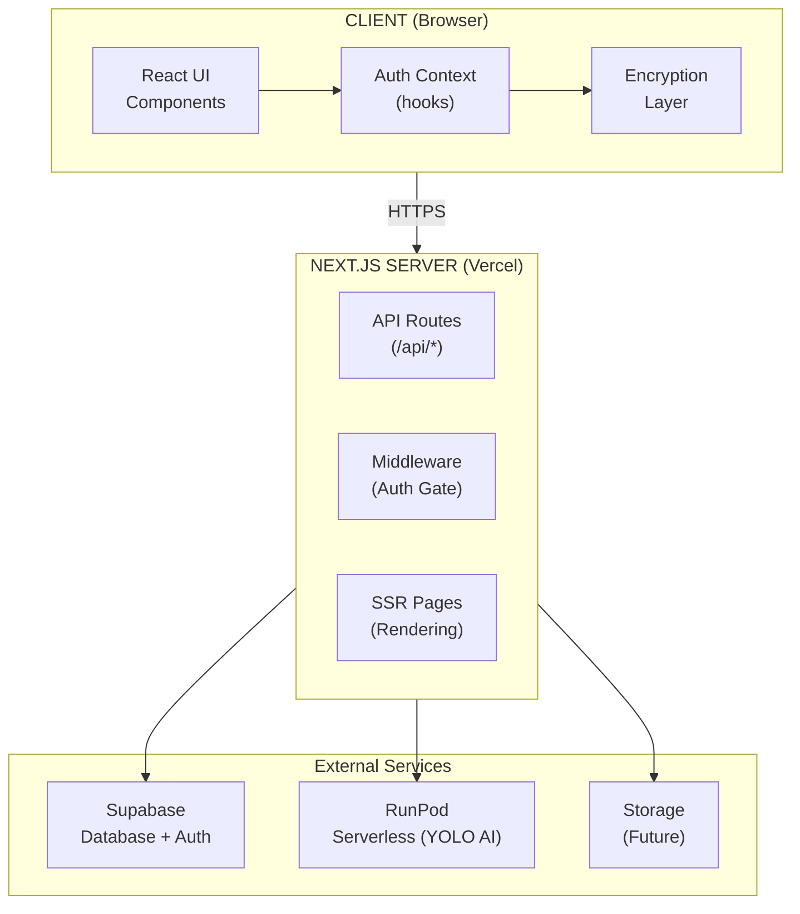
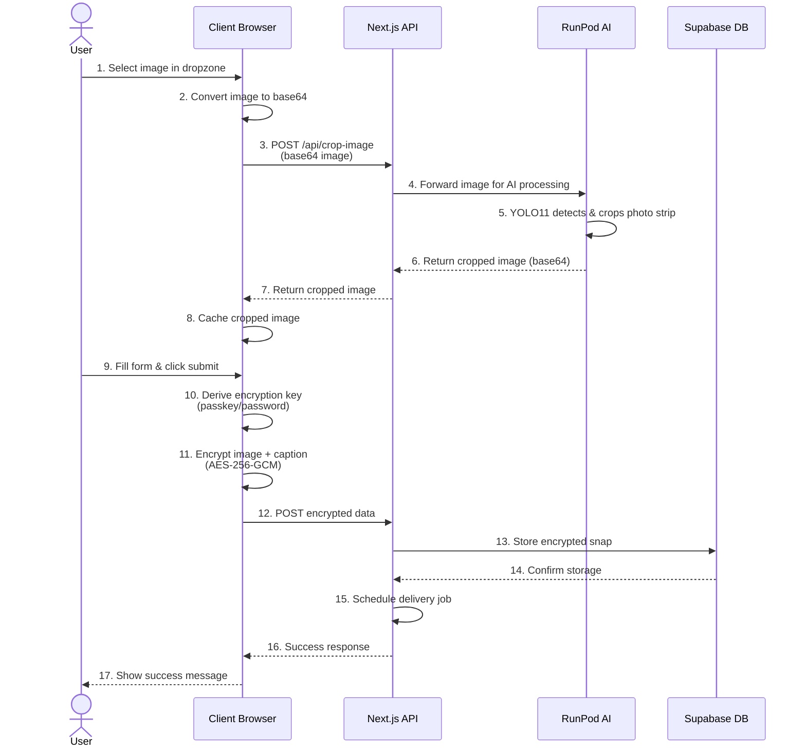
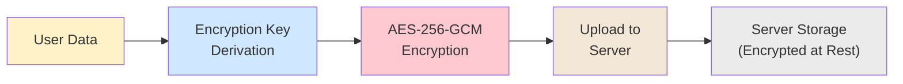

<div align="center">
  
  <h1>ReStrip Technical Documentation</h1>
  <p><em>Photo strips that come back to you.</em></p>
</div>

This document provides comprehensive technical documentation for the ReStrip project. It's designed to help developers—especially those with beginner to intermediate web development experience—understand the entire codebase, architecture, and development workflow.

---

## Table of Contents

1. [Introduction & Project Overview](#1-introduction--project-overview)
2. [Getting Started](#2-getting-started)
3. [Architecture Overview](#3-architecture-overview)
4. [Frontend Deep Dive](#4-frontend-deep-dive)
5. [Backend Deep Dive](#5-backend-deep-dive)
6. [Authentication System](#6-authentication-system)
7. [Encryption System](#7-encryption-system)
8. [Database & Storage](#8-database--storage)
9. [AI Image Processing Pipeline](#9-ai-image-processing-pipeline)
10. [API Routes Reference](#10-api-routes-reference)
11. [Component Library](#11-component-library)
12. [State Management](#12-state-management)
13. [Styling & Design System](#13-styling--design-system)
14. [Development Workflow](#14-development-workflow)
15. [Security Best Practices](#15-security-best-practices)
16. [Troubleshooting Guide](#16-troubleshooting-guide)

---

## 1. Introduction & Project Overview

### What is ReStrip?

ReStrip is a **time-delayed memory delivery platform** that allows users to upload photo strips today and receive them back months later via email. The platform implements **zero-knowledge encryption**, meaning even the server cannot decrypt users' photos.

### Key Features

- 🔐 **Zero-Knowledge Encryption**: Photos encrypted client-side before upload  
- 🔑 **Modern Authentication**: Passkey (biometric) and password options  
- 🤖 **AI Auto-Crop**: YOLO11-powered photo strip detection  
- 📅 **Flexible Scheduling**: Random surprise, custom period, or specific date  
- 🎨 **Beautiful UX**: Smooth animations and responsive design  
- 🔒 **Privacy-First**: No third-party data sharing or AI training

### Technology Philosophy

ReStrip prioritizes:
1. **Privacy**: User data is sacred and encrypted
2. **Security**: Modern standards (WebAuthn, AES-256-GCM)
3. **User Experience**: Simple, delightful interactions
4. **Developer Experience**: Clean code, TypeScript, modern tooling
5. **Performance**: Fast, responsive, optimized

### Project Status

**Version**: 1.0 (MVP)  
**Status**: In development - Core features complete, integration in progress

---

## 2. Getting Started

### Prerequisites

- **Node.js**: v18.0.0 or higher ([Download](https://nodejs.org/))
- **npm**: v9.0.0 or higher (comes with Node.js)
- **Git**: For version control
- **Supabase Account**: For database and auth ([Sign up](https://supabase.com/))
- **RunPod Account** (optional): For AI image processing

### Installation Steps

#### 1. Clone the Repository

```bash
git clone https://github.com/bjh-developer/restrip.git
cd restrip
```

#### 2. Install Dependencies

```bash
npm install
```

#### 3. Environment Variables Setup

Create `.env.local` file:

```env
# Supabase Configuration
NEXT_PUBLIC_SUPABASE_URL=https://<supabase id>.supabase.co
NEXT_PUBLIC_SUPABASE_ANON_KEY=<supabase anon key>
SUPABASE_SERVICE_ROLE_KEY=<supabase service role key>

# RunPod Configuration (Server-side only)
RUNPOD_API_KEY=<runpod api key>
RUNPOD_ENDPOINT_ID=<runpod endpoint id>

# Application Configuration
NEXT_PUBLIC_APP_URL=http://localhost:3000
# Comma-separated list of allowed origins (supports wildcard patterns like *.vercel.app)
NEXT_PUBLIC_ALLOWED_ORIGINS=*.vercel.app
# Comma-separated list of allowed RP domains (for WebAuthn RP ID validation)
NEXT_PUBLIC_ALLOWED_RP_DOMAINS=localhost,127.0.0.1
```

#### 4. Supabase Setup

**Create Database Tables:**

Run in Supabase SQL Editor:

```sql
-- Enable UUID extension
CREATE EXTENSION IF NOT EXISTS "uuid-ossp";

-- Create credentials table for passkey authentication
CREATE TABLE public.credentials (
    id TEXT PRIMARY KEY,
    user_id UUID NOT NULL REFERENCES auth.users(id) ON DELETE CASCADE,
    public_key BYTEA NOT NULL,
    counter BIGINT NOT NULL DEFAULT 0,
    transports TEXT[],
    backup_eligible BOOLEAN DEFAULT FALSE,
    backup_state BOOLEAN DEFAULT FALSE,
    salt TEXT NOT NULL,
    created_at TIMESTAMP WITH TIME ZONE DEFAULT NOW(),
    last_used_at TIMESTAMP WITH TIME ZONE,
    CONSTRAINT unique_user_credential UNIQUE (user_id, id)
);

CREATE INDEX idx_credentials_user_id ON public.credentials(user_id);

ALTER TABLE public.credentials ENABLE ROW LEVEL SECURITY;

-- RLS Policies
CREATE POLICY "Users can view own credentials"
    ON public.credentials FOR SELECT
    USING (auth.uid() = user_id);
```

#### 5. Run Development Server

```bash
npm run dev
# Open http://localhost:3000
```

### Project Scripts

```bash
npm run dev    # Start development server
npm run build  # Create production build
npm run start  # Start production server
npm run lint   # Run ESLint
```

---

## 3. Architecture Overview

### High-Level Architecture



### Technology Stack Layers

#### Frontend
- **Framework**: Next.js 16 with React 19
- **Language**: TypeScript
- **Styling**: Tailwind CSS + Shadcn UI
- **State**: React Context + Hooks
- **Animations**: GSAP + ScrollTrigger

#### Backend
- **Runtime**: Next.js API Routes (Serverless)
- **Database**: Supabase (PostgreSQL)
- **Authentication**: Supabase Auth + SimpleWebAuthn
- **External Services**: RunPod (AI processing)

#### Security
- **Encryption**: Web Crypto API (AES-256-GCM)
- **Key Derivation**: HKDF (passkey) + PBKDF2 (password)
- **Authentication**: WebAuthn/FIDO2 + Email/Password

### Request Flow Example

### Request Flow Example

**User uploads a photo:**



**Key Steps:**
- **Steps 1-7**: Image upload and AI auto-crop
- **Steps 8-11**: Client-side encryption (zero-knowledge)
- **Steps 12-17**:  Secure storage and scheduling

---

## 4. Frontend Deep Dive

### Next.js App Router Structure

#### Route Groups

Route groups use parentheses `()` to organize files without affecting URLs.

```
app/
  (auth)/
    page.tsx          → URL: /
  (protected)/
    upload/
      page.tsx        → URL: /upload
  (misc)/
    contact/
      page.tsx        → URL: /contact
```

**Benefits:**
- Shared layouts for route groups
- Logical organization
- Clean URLs

#### Key Pages

**1. Authentication Page** (`src/app/(auth)/page.tsx`)

Landing page with sign-in/sign-up functionality.

**Features:**
- Passkey authentication (primary)
- Email/password authentication (fallback)
- Tab switcher based on passkey support
- Email verification handling
- Auto-redirect when authenticated

**Key Logic:**

```typescript
// Redirect if authenticated
useEffect(() => {
  if (user && hasEncryptionKey) {
    router.push('/upload');
  }
}, [user, hasEncryptionKey, router]);
```

**2. Upload Page** (`src/app/(protected)/upload/page.tsx`)

Main application page with 4-step flow:
1. Upload photo strip
2. Write caption
3. Select delivery period
4. Choose delivery method

**Key State:**

```typescript
const [originalImage, setOriginalImage] = useState<string>();
const [croppedImage, setCroppedImage] = useState<string>();
const [autoCropEnabled, setAutoCropEnabled] = useState(false);
const [scheduledSendTime, setScheduledSendTime] = useState<Date>();
const [caption, setCaption] = useState<string>("");
```

**Form Validation:**

Uses Zod for type-safe validation:

```typescript
const SnapSchema = z.object({
  Image: z.string().min(1, "Image is required"),
  Caption: z.string().min(1),
  sendTime: z.date(),
  deliveryMethod: z.enum(["email", "telegram"]),
  Delivery_Address: z.string().min(1),
}).refine((data) => {
  if (data.deliveryMethod === "email") {
    return z.string().email().safeParse(data.Delivery_Address).success;
  }
  return data.Delivery_Address.startsWith("@");
});
```

### Key Components

#### Auth Components

**PasskeyAuth.tsx**

Handles WebAuthn passkey registration and authentication.

**Flow:**
1. Check if email exists → Register or Login
2. If registering, send email verification first
3. User verifies email via link
4. Get WebAuthn options from server
5. Call browser WebAuthn API
6. Verify with server
7. Derive encryption key from PRF output
6. Store key in sessionStorage

**EmailPasswordAuth.tsx**

Traditional email/password authentication.

**Features:**
- Sign up with email verification
- Sign in with password
- Password reset flow
- Encryption key derivation from password using PBKDF2

#### UI Components

**PeriodPicker.tsx**

Date/period selection component with three options:
- **Surprise Me**: Random 30-180 days
- **Custom Period**: Select days/months/years
- **Custom Date**: Calendar picker

**DeliveryMethodPicker.tsx**

Choose delivery method:
- **Email**: Enter email address
- **Telegram** (future): Enter @username

**ScrollReveal.tsx**

GSAP-powered scroll animation wrapper.

**Usage:**
```typescript
<ScrollReveal baseOpacity={0} enableBlur={true}>
  <p>This text animates on scroll</p>
</ScrollReveal>
```

**ShinyText.tsx**

Animated gradient text effect.

```typescript
<ShinyText 
  text="Photo strips that come back to you."
  speed={15}
/>
```

#### Shadcn UI Components

Custom components in `src/components/ui/shadcn-io/`:

- **Dropzone**: File upload with drag-and-drop
- **Spinner**: Loading indicator (pinwheel variant)
- **Banner**: Dismissible announcements
- **Announcement**: Info pills

### Hooks

#### useAuth Hook

Centralized authentication state management.

**Provides:**
```typescript
const {
  user,                    // Current user or null
  session,                 // Supabase session
  authMethod,              // 'passkey' | 'password' | null
  isLoading,               // Auth check in progress
  hasEncryptionKey,        // Encryption key available
  signOut,                 // Sign out function
  setEncryptionKeyFromPRF, // Set key from passkey
  setEncryptionKeyFromPassword // Set key from password
} = useAuth();
```

**Implementation:**

```typescript
export function AuthProvider({ children }) {
  const [user, setUser] = useState<User | null>(null);
  const [isLoading, setIsLoading] = useState(true);
  const supabase = useMemo(() => createClient(), []);
  
  useEffect(() => {
    // Get initial session
    const initAuth = async () => {
      const { data: { session } } = await supabase.auth.getSession();
      if (session) {
        setUser(session.user);
        // Check for encryption key
        const key = await getEncryptionKey();
        if (key) setEncryptionKeySet(true);
      }
      setIsLoading(false);
    };
    
    initAuth();
    
    // Listen for auth changes
    const { data: { subscription } } = supabase.auth.onAuthStateChange(
      (event, session) => {
        if (session) {
          setUser(session.user);
        } else {
          setUser(null);
          clearEncryptionKey();
        }
      }
    );
    
    return () => subscription.unsubscribe();
  }, []);
  
  return (
    <AuthContext.Provider value={{/* ... */}}>
      {children}
    </AuthContext.Provider>
  );
}
```

#### usePasskeySupport Hook

Detects if browser/device supports passkeys.

```typescript
export function usePasskeySupport() {
  const [passkeySupported, setPasskeySupported] = useState(false);
  const [isLoading, setIsLoading] = useState(true);
  
  useEffect(() => {
    const checkSupport = async () => {
      if (!window.PublicKeyCredential) {
        setPasskeySupported(false);
        return;
      }
      
      const available = await PublicKeyCredential
        .isUserVerifyingPlatformAuthenticatorAvailable();
      setPasskeySupported(available);
      setIsLoading(false);
    };
    
    checkSupport();
  }, []);
  
  return { passkeySupported, isLoading };
}
```

---

## 5. Backend Deep Dive

### Next.js API Routes

API routes are serverless functions in `src/app/api/`.

**Structure:**
- Export named functions: `GET`, `POST`, `PUT`, `DELETE`
- Receive `NextRequest`, return `NextResponse`
- Run on Vercel Edge Runtime

**Example:**

```typescript
// src/app/api/example/route.ts
import { NextRequest, NextResponse } from 'next/server';

export async function POST(request: NextRequest) {
  const body = await request.json();
  return NextResponse.json({ received: body });
}
```

### Key API Routes

#### `/api/crop-image`

**Purpose**: Proxy image to RunPod for AI cropping

**Why a proxy?**
- ✅ Keeps API key secret (server-side only)
- ✅ Prevents key exposure to client
- ✅ Allows rate limiting
- ✅ Error handling layer

**Implementation:**

```typescript
export async function POST(request: NextRequest) {
  const { image } = await request.json();
  
  const apiKey = process.env.RUNPOD_API_KEY;
  const endpointId = process.env.RUNPOD_ENDPOINT_ID;
  
  const url = `https://api.runpod.ai/v2/${endpointId}/runsync`;
  
  // Remove data URL prefix
  const base64Data = image.split(',')[1] || image;
  
  // Call RunPod
  const response = await fetch(url, {
    method: 'POST',
    headers: {
      'Content-Type': 'application/json',
      'Authorization': `Bearer ${apiKey}`,
    },
    body: JSON.stringify({ input: { image: base64Data } }),
  });
  
  const data = await response.json();
  
  return NextResponse.json({
    success: true,
    photostrip: data.output.photostrip,
  });
}
```

#### `/api/auth/passkey/register-options`

Generate WebAuthn registration options.

**Request:**
```json
{ "email": "user@example.com" }
```

**Response:**
```json
{
  "options": {
    "challenge": "...",
    "rp": { "name": "ReStrip", "id": "localhost" },
    "user": { "id": "...", "name": "...", "displayName": "..." },
    "extensions": { "prf": {} }
  },
  "salt": "base64-salt"
}
```

#### `/api/auth/passkey/register-verify`

Verify WebAuthn registration response.

**Process:**
1. Verify WebAuthn response
2. Create/sign in user with Supabase
3. Store credential in database
4. Return success

#### `/api/auth/passkey/login-options`

Generate WebAuthn authentication options.

#### `/api/auth/passkey/login-verify`

Verify WebAuthn authentication response.

### Middleware

**Purpose**: Protect routes and manage sessions

**File**: `middleware.ts`

```typescript
export async function middleware(request: NextRequest) {
  // Create Supabase client with cookie handling
  const supabase = createServerClient(/* ... */);
  
  // Get session
  const { data: { session } } = await supabase.auth.getSession();
  
  // Protect /upload route
  if (request.nextUrl.pathname.startsWith('/upload')) {
    if (!session) {
      return NextResponse.redirect(new URL('/', request.url));
    }
  }
  
  return response;
}

export const config = {
  matcher: ['/', '/upload/:path*'],
};
```

---

## 6. Authentication System

### Overview

ReStrip supports two authentication methods:

1. **Passkey (WebAuthn)** - Biometric authentication
2. **Email/Password** - Traditional authentication

Both can be linked to the same account for redundancy.

### Passkey Authentication (WebAuthn)

**How it works:**

1. **Registration:**
   - User provides email
   - System sends email verification link
   - User clicks verification link in email
   - Server generates WebAuthn challenge
   - Browser prompts for biometric (Face ID, fingerprint)
   - Device creates cryptographic key pair
   - Public key sent to server, private key stays on device
   - PRF extension derives encryption key

2. **Login:**
   - User initiates login
   - Server generates challenge
   - Browser prompts for biometric
   - Device signs challenge with private key
   - Server verifies signature
   - PRF generates same encryption key

**Benefits:**
- ✅ Phishing-resistant
- ✅ No passwords to remember
- ✅ Hardware-backed security
- ✅ Fast and convenient

**Browser Support:**
- Chrome/Edge 67+
- Safari 16+
- Firefox 119+

### Email/Password Authentication

**How it works:**

1. **Sign Up:**
   - User provides email and password
   - Supabase sends verification email
   - User clicks link to verify
   - Encryption key derived from password using PBKDF2

2. **Sign In:**
   - User enters email and password
   - Supabase verifies credentials
   - Encryption key derived from password

**Key Derivation:**

```typescript
async function deriveKeyFromPassword(password: string, salt: Uint8Array) {
  const keyMaterial = await crypto.subtle.importKey(
    'raw',
    new TextEncoder().encode(password),
    'PBKDF2',
    false,
    ['deriveKey']
  );
  
  const key = await crypto.subtle.deriveKey(
    {
      name: 'PBKDF2',
      salt,
      iterations: 600000, // OWASP 2024 recommendation
      hash: 'SHA-256',
    },
    keyMaterial,
    { name: 'AES-GCM', length: 256 },
    true,
    ['encrypt', 'decrypt']
  );
  
  return key;
}
```

### Account Linking

Users can add both authentication methods to one account:

**Scenarios:**
- Passkey user adds password backup
- Password user upgrades to passkey

**Implementation:**

```typescript
// Add password to passkey account
await supabase.auth.updateUser({ password: newPassword });

// Add passkey to password account
// Use passkey registration flow (auto-links to existing user)
```

---

## 7. Encryption System

### Zero-Knowledge Encryption

**What it means:**
- Data encrypted on client before upload
- Encryption key never leaves user's device
- Server cannot decrypt data
- True privacy by design

### Encryption Flow



### Key Derivation

**From Passkey (PRF):**

```typescript
async function deriveKeyFromPRF(prfOutput: ArrayBuffer): Promise<CryptoKey> {
  const keyMaterial = await crypto.subtle.importKey(
    'raw',
    prfOutput,
    'HKDF',
    false,
    ['deriveKey']
  );
  
  const key = await crypto.subtle.deriveKey(
    {
      name: 'HKDF',
      hash: 'SHA-256',
      salt: new TextEncoder().encode('restrip-encryption-v1'),
      info: new TextEncoder().encode('image-encryption'),
    },
    keyMaterial,
    { name: 'AES-GCM', length: 256 },
    true,
    ['encrypt', 'decrypt']
  );
  
  return key;
}
```

**From Password (PBKDF2):**

Uses 600,000 iterations (OWASP 2024 recommendation).

### Encryption Implementation

**Encrypt Data:**

```typescript
async function encryptData(data: ArrayBuffer, key: CryptoKey) {
  const iv = crypto.getRandomValues(new Uint8Array(12)); // 96 bits for AES-GCM
  
  const encrypted = await crypto.subtle.encrypt(
    { name: 'AES-GCM', iv },
    key,
    data
  );
  
  return {
    encrypted: arrayBufferToBase64(encrypted),
    iv: arrayBufferToBase64(iv.buffer),
  };
}
```

**Decrypt Data:**

```typescript
async function decryptData(
  encryptedBase64: string,
  ivBase64: string,
  key: CryptoKey
): Promise<ArrayBuffer> {
  const encrypted = base64ToArrayBuffer(encryptedBase64);
  const iv = base64ToArrayBuffer(ivBase64);
  
  const decrypted = await crypto.subtle.decrypt(
    { name: 'AES-GCM', iv: new Uint8Array(iv) },
    key,
    encrypted
  );
  
  return decrypted;
}
```

### Key Storage

**Challenge**: Persist key across page refreshes while maintaining security

**Solution**: Store in `sessionStorage` with 10-minute timeout

**Security Tradeoffs:**
- ⚠️ Vulnerable to XSS attacks
- ✅ Cleared on tab close
- ✅ 10-minute expiry
- ✅ CSP headers reduce XSS risk

**Implementation:**

```typescript
export async function setEncryptionKey(key: CryptoKey): Promise<void> {
  encryptionKeyStore = key; // In-memory
  
  // Export and store in sessionStorage
  const exportedKey = await crypto.subtle.exportKey('raw', key);
  const keyBase64 = arrayBufferToBase64(exportedKey);
  const timestamp = Date.now().toString();
  
  sessionStorage.setItem('restrip_encryption_key', keyBase64);
  sessionStorage.setItem('restrip_encryption_key_timestamp', timestamp);
}

export async function getEncryptionKey(): Promise<CryptoKey | null> {
  // If key is in memory, return it
  if (encryptionKeyStore) {
    return encryptionKeyStore;
  }
  
  // Try to restore from sessionStorage
  try {
    const keyBase64 = sessionStorage.getItem(ENCRYPTION_KEY_STORAGE_KEY);
    const timestampStr = sessionStorage.getItem(ENCRYPTION_KEY_TIMESTAMP_KEY);
    
    if (!keyBase64 || !timestampStr) {
      return null;
    }
    
    // Check if key has expired
    const timestamp = parseInt(timestampStr, 10);
    const age = Date.now() - timestamp;
    
    if (age > KEY_EXPIRY_MS) {
      console.warn('⚠️ Encryption key expired (10 min timeout). Please re-authenticate.');
      clearEncryptionKey();
      return null;
    }
    
    const keyBuffer = base64ToArrayBuffer(keyBase64);
    const key = await crypto.subtle.importKey(
      'raw',
      keyBuffer,
      { name: 'AES-GCM', length: 256 },
      true, // Make it extractable so it can be persisted again if needed
      ['encrypt', 'decrypt']
    );
    
    encryptionKeyStore = key;
    console.log('✅ Encryption key restored from sessionStorage');
    return key;
  } catch (error) {
    console.error('Failed to restore encryption key:', error);
    // Clear invalid stored key
    clearEncryptionKey();
    return null;
  }
}
```

---

## 8. Database & Storage

### Supabase Database

**Technology**: PostgreSQL with Row Level Security (RLS)

### Complete Database Schema

Run this SQL in your Supabase SQL Editor to set up the complete database:

```sql
-- =====================================================
-- ReStrip Passkey Authentication Schema
-- Run this in your Supabase SQL Editor
-- =====================================================

-- 1. Create passkey_credentials table to store public keys
CREATE TABLE IF NOT EXISTS public.passkey_credentials (
  id UUID PRIMARY KEY DEFAULT gen_random_uuid(),
  user_id UUID NOT NULL REFERENCES auth.users(id) ON DELETE CASCADE,
  credential_id TEXT UNIQUE NOT NULL,           -- Base64URL encoded credential ID
  public_key TEXT NOT NULL,                      -- Base64URL encoded public key
  counter BIGINT DEFAULT 0,                      -- For replay attack prevention
  device_type TEXT DEFAULT 'platform',           -- 'platform' or 'cross-platform'
  backed_up BOOLEAN DEFAULT false,               -- Is credential synced (iCloud Keychain, etc)
  transports TEXT[],                             -- ['internal', 'hybrid', 'usb', etc]
  aaguid TEXT,                                   -- Authenticator identifier
  device_name TEXT,                              -- User-friendly device name
  created_at TIMESTAMPTZ DEFAULT NOW(),
  last_used_at TIMESTAMPTZ
);

-- Create indexes for faster lookups
CREATE INDEX IF NOT EXISTS idx_passkey_user_id ON public.passkey_credentials(user_id);
CREATE INDEX IF NOT EXISTS idx_passkey_credential_id ON public.passkey_credentials(credential_id);

-- 2. Create snaps table with user_id for authenticated uploads
CREATE TABLE IF NOT EXISTS public.snaps (
  id UUID PRIMARY KEY DEFAULT gen_random_uuid(),
  user_id UUID REFERENCES auth.users(id) ON DELETE CASCADE,
  delivery_method TEXT NOT NULL DEFAULT 'email',  -- 'email' or 'telegram'
  delivery_address TEXT NOT NULL,                 -- Email or @telegram_username
  encrypted_image_url TEXT NOT NULL,              -- URL to encrypted image in storage
  encrypted_cropped_url TEXT,                     -- URL to encrypted cropped image
  encrypted_caption TEXT,                         -- AES encrypted caption
  caption_iv TEXT,                                -- IV for caption decryption
  period_type TEXT NOT NULL,                      -- 'surprise', 'custom_period', 'custom_date'
  send_date DATE NOT NULL,
  send_time TIMESTAMPTZ NOT NULL,
  delivered BOOLEAN DEFAULT FALSE,
  delivered_at TIMESTAMPTZ,
  created_at TIMESTAMPTZ DEFAULT NOW(),
  updated_at TIMESTAMPTZ DEFAULT NOW()
);

-- Create indexes for snaps
CREATE INDEX IF NOT EXISTS idx_snaps_user_id ON public.snaps(user_id);
CREATE INDEX IF NOT EXISTS idx_snaps_send_date ON public.snaps(send_date, delivered);
CREATE INDEX IF NOT EXISTS idx_snaps_delivery ON public.snaps(delivery_address);

-- 3. Create challenge store for WebAuthn (temporary storage)
CREATE TABLE IF NOT EXISTS public.webauthn_challenges (
  id UUID PRIMARY KEY DEFAULT gen_random_uuid(),
  user_id UUID REFERENCES auth.users(id) ON DELETE CASCADE,
  email TEXT,                                     -- For registration before user exists
  challenge TEXT NOT NULL,                        -- Base64URL encoded challenge
  type TEXT NOT NULL,                             -- 'registration' or 'authentication'
  expires_at TIMESTAMPTZ NOT NULL,
  created_at TIMESTAMPTZ DEFAULT NOW()
);

CREATE INDEX IF NOT EXISTS idx_challenge_email ON public.webauthn_challenges(email);
CREATE INDEX IF NOT EXISTS idx_challenge_user_id ON public.webauthn_challenges(user_id);


-- 4. Row Level Security (RLS) Policies

-- Enable RLS on all tables
ALTER TABLE public.passkey_credentials ENABLE ROW LEVEL SECURITY;
ALTER TABLE public.snaps ENABLE ROW LEVEL SECURITY;
ALTER TABLE public.webauthn_challenges ENABLE ROW LEVEL SECURITY;

-- Passkey credentials: Users can only see/manage their own credentials
CREATE POLICY "Users can view own passkey credentials"
  ON public.passkey_credentials FOR SELECT
  USING (auth.uid() = user_id);

CREATE POLICY "Users can insert own passkey credentials"
  ON public.passkey_credentials FOR INSERT
  WITH CHECK (auth.uid() = user_id);

CREATE POLICY "Users can update own passkey credentials"
  ON public.passkey_credentials FOR UPDATE
  USING (auth.uid() = user_id);

CREATE POLICY "Users can delete own passkey credentials"
  ON public.passkey_credentials FOR DELETE
  USING (auth.uid() = user_id);

-- Snaps: Users can only see/manage their own snaps
CREATE POLICY "Users can view own snaps"
  ON public.snaps FOR SELECT
  USING (auth.uid() = user_id);

CREATE POLICY "Users can insert own snaps"
  ON public.snaps FOR INSERT
  WITH CHECK (auth.uid() = user_id);

CREATE POLICY "Users can update own snaps"
  ON public.snaps FOR UPDATE
  USING (auth.uid() = user_id);

CREATE POLICY "Users can delete own snaps"
  ON public.snaps FOR DELETE
  USING (auth.uid() = user_id);

-- WebAuthn challenges: Service role only (API routes use service role)
-- No policies needed - handled by service role key

-- 5. Create storage bucket for encrypted images
INSERT INTO storage.buckets (id, name, public)
VALUES ('encrypted-images', 'encrypted-images', false)
ON CONFLICT (id) DO NOTHING;

-- Storage policy: Users can only access their own files
CREATE POLICY "Users can upload own encrypted images"
  ON storage.objects FOR INSERT
  WITH CHECK (
    bucket_id = 'encrypted-images' AND
    auth.uid()::text = (storage.foldername(name))[1]
  );

CREATE POLICY "Users can view own encrypted images"
  ON storage.objects FOR SELECT
  USING (
    bucket_id = 'encrypted-images' AND
    auth.uid()::text = (storage.foldername(name))[1]
  );

CREATE POLICY "Users can delete own encrypted images"
  ON storage.objects FOR DELETE
  USING (
    bucket_id = 'encrypted-images' AND
    auth.uid()::text = (storage.foldername(name))[1]
  );

-- 6. Function to clean up expired challenges (run periodically)
CREATE OR REPLACE FUNCTION cleanup_expired_challenges()
RETURNS void AS $$
BEGIN
  DELETE FROM public.webauthn_challenges WHERE expires_at < NOW();
END;
$$ LANGUAGE plpgsql SECURITY DEFINER;

-- 7. Function to update snaps timestamp
CREATE OR REPLACE FUNCTION update_updated_at()
RETURNS TRIGGER AS $$
BEGIN
  NEW.updated_at = NOW();
  RETURN NEW;
END;
$$ LANGUAGE plpgsql;

CREATE TRIGGER snaps_updated_at
  BEFORE UPDATE ON public.snaps
  FOR EACH ROW
  EXECUTE FUNCTION update_updated_at();

-- =====================================================
-- Add Per-Credential PRF Salt for WebAuthn Isolation
-- 
-- This migration adds the 'salt' column to store unique,
-- cryptographically random salts for each credential.
-- 
-- Security: Each credential must have a unique salt to ensure
-- per-credential isolation and prevent salt reuse attacks.
-- =====================================================

-- Add salt column to passkey_credentials table
-- salt: Base64-encoded cryptographically random 32-byte value
ALTER TABLE public.passkey_credentials 
ADD COLUMN IF NOT EXISTS salt TEXT;

-- Create index for salt lookups (useful for future optimizations)
CREATE INDEX IF NOT EXISTS idx_passkey_salt ON public.passkey_credentials(salt);

-- Add constraint to ensure salt is non-empty if present
ALTER TABLE public.passkey_credentials 
ADD CONSTRAINT check_salt_not_empty CHECK (salt IS NULL OR salt != '');

-- Auto-generate salts for existing credentials
-- This ensures all credentials (old and new) have salts
UPDATE public.passkey_credentials 
SET salt = encode(gen_random_bytes(32), 'base64')
WHERE salt IS NULL;

-- Verify migration completed successfully
-- Run this query to confirm all credentials have salts:
-- SELECT COUNT(*) as total, COUNT(salt) as with_salt FROM passkey_credentials;
-- Both counts should be equal, indicating 100% salt coverage

-- Create RPC function to check if user exists by email
-- This function queries the auth.users table which is not directly accessible via PostgREST
CREATE OR REPLACE FUNCTION check_user_exists(user_email TEXT)
RETURNS BOOLEAN AS $$
BEGIN
  RETURN EXISTS (
    SELECT 1 FROM auth.users WHERE email = LOWER(user_email)
  );
END;
$$ LANGUAGE plpgsql SECURITY DEFINER;

-- Revoke all default permissions
REVOKE EXECUTE ON FUNCTION check_user_exists(TEXT) FROM public;
REVOKE EXECUTE ON FUNCTION check_user_exists(TEXT) FROM authenticated;
REVOKE EXECUTE ON FUNCTION check_user_exists(TEXT) FROM anon;

-- Grant execute permission only to service_role
GRANT EXECUTE ON FUNCTION check_user_exists(TEXT) TO service_role;

-- RPC function for efficient account type lookup
-- This should be created in your Supabase database

CREATE OR REPLACE FUNCTION get_account_type(user_email TEXT)
RETURNS TABLE(account_type TEXT, has_passkey BOOLEAN)
LANGUAGE plpgsql
SECURITY DEFINER
AS $$
DECLARE
    user_record RECORD;
    passkey_count INTEGER;
BEGIN
    -- Find user by email
    SELECT * INTO user_record
    FROM auth.users
    WHERE email = LOWER(user_email)
    LIMIT 1;

    -- If user not found, return none
    IF user_record.id IS NULL THEN
        RETURN QUERY SELECT 'none'::TEXT, false;
        RETURN;
    END IF;

    -- Get auth method from metadata
    DECLARE
        auth_method TEXT := COALESCE(user_record.raw_user_meta_data->>'auth_method', 'password');
    BEGIN
        -- Check for passkey credentials
        SELECT COUNT(*) INTO passkey_count
        FROM passkey_credentials
        WHERE user_id = user_record.id
        LIMIT 1;

        -- Determine if user has passkey
        DECLARE
            has_passkey BOOLEAN := (passkey_count > 0) OR (auth_method = 'passkey') OR (auth_method = 'password_and_passkey');
        BEGIN
            RETURN QUERY SELECT auth_method, has_passkey;
        END;
    END;
END;
$$;
```

### Schema Explanation

**passkey_credentials table:**
- Stores WebAuthn public keys for passkey authentication
- Each credential has a unique salt for PRF-based encryption key derivation
- Tracks device information and usage

**snaps table:**
- Stores encrypted photo strip memories
- References encrypted images in Supabase Storage
- Tracks delivery schedule and status

**webauthn_challenges table:**
- Temporary storage for WebAuthn challenges
- Expires after use for security

**Helper Functions:**
- `cleanup_expired_challenges()`: Clean up old challenges
- `check_user_exists()`: Check if email is registered
- `get_account_type()`: Get user's authentication method

---

## 9. AI Image Processing Pipeline

### RunPod Serverless

**Purpose**: GPU-accelerated AI image processing

**Why RunPod?**
- ✅ Serverless (pay per use)
- ✅ GPU access (CUDA)
- ✅ Fast inference
- ✅ Auto-scaling

### YOLO11 Model

**Purpose**: Detect and segment photo strips from images

**How it works:**

1. **Input**: Base64-encoded image
2. **Detection**: YOLO11 identifies photo strip in image
3. **Segmentation**: Creates mask of photo strip pixels
4. **Cropping**: Extracts photo strip with transparent background
5. **Straightening**: Applies perspective transform
6. **Orientation**: Ensures vertical (portrait) orientation
7. **Output**: Base64-encoded cropped image

### Handler Implementation

**File**: `runpod/handler.py`

**Key Functions:**

```python
def detect_crop_photostrip(image_data):
    # Decode base64 image
    image_bytes = base64.b64decode(image_data)
    img = Image.open(BytesIO(image_bytes))
    
    # Run YOLO11 prediction
    results = model.predict(source=img)
    
    # Extract first detection
    for r in results:
        img = np.copy(r.orig_img)
        
        # Get segmentation mask
        for c in r:
            contour = c.masks.xy[0].astype(np.int32)
            
            # Create binary mask
            mask = np.zeros(img.shape[:2], np.uint8)
            cv2.drawContours(mask, [contour], -1, 255, cv2.FILLED)
            
            # Isolate photo strip with transparent background
            isolated = np.dstack([img, mask])
            
            # Get bounding box
            x1, y1, x2, y2 = c.boxes.xyxy.cpu().numpy().squeeze().astype(np.int32)
            iso_crop = isolated[y1:y2, x1:x2]
    
    # Straighten using perspective transform
    straightened = straighten_transparent_crop(iso_crop)
    
    # Ensure vertical orientation
    final = ensure_vertical_orientation(straightened)
    
    # Encode to base64
    success, buffer = cv2.imencode('.png', final)
    photostrip_base64 = base64.b64encode(buffer.tobytes()).decode('utf-8')
    
    return { 'success': True, 'photostrip': photostrip_base64 }
```

**Straightening Algorithm:**

```python
def straighten_transparent_crop(iso_crop):
    # Extract alpha channel (transparency mask)
    alpha = iso_crop[:, :, 3]
    
    # Find contour of photo strip
    contours, _ = cv2.findContours(alpha, cv2.RETR_EXTERNAL, cv2.CHAIN_APPROX_SIMPLE)
    contour = max(contours, key=cv2.contourArea)
    
    # Get minimum area rectangle (handles rotation)
    rect = cv2.minAreaRect(contour)
    box = cv2.boxPoints(rect)
    
    # Order corners: top-left, top-right, bottom-right, bottom-left
    rect_ordered = order_points(box.astype("float32"))
    
    # Calculate output dimensions
    (tl, tr, br, bl) = rect_ordered
    maxWidth = max(
        int(np.sqrt((br[0] - bl[0])**2 + (br[1] - bl[1])**2)),
        int(np.sqrt((tr[0] - tl[0])**2 + (tr[1] - tl[1])**2))
    )
    maxHeight = max(
        int(np.sqrt((tr[0] - br[0])**2 + (tr[1] - br[1])**2)),
        int(np.sqrt((tl[0] - bl[0])**2 + (tl[1] - bl[1])**2))
    )
    
    # Define destination points (perfect rectangle)
    dst = np.array([
        [0, 0],
        [maxWidth - 1, 0],
        [maxWidth - 1, maxHeight - 1],
        [0, maxHeight - 1]
    ], dtype="float32")
    
    # Get perspective transform matrix
    M = cv2.getPerspectiveTransform(rect_ordered, dst)
    
    # Apply transform
    straightened = cv2.warpPerspective(
        iso_crop, M, (maxWidth, maxHeight),
        flags=cv2.INTER_LINEAR,
        borderMode=cv2.BORDER_CONSTANT,
        borderValue=(0, 0, 0, 0)  # Transparent border
    )
    
    return straightened
```

### Docker Configuration

**File**: `Dockerfile`

```dockerfile
FROM runpod/pytorch:2.1.0-py3.10-cuda11.8.0-devel-ubuntu22.04

WORKDIR /app

# Install system dependencies
RUN apt-get update && apt-get install -y \
    libgl1-mesa-glx \
    libglib2.0-0 \
    && rm -rf /var/lib/apt/lists/*

# Copy requirements and install
COPY runpod/requirements.txt .
RUN pip install --no-cache-dir -r requirements.txt

# Copy model weights
COPY runpod/runs/segment/train/weights/best.pt /app/runs/segment/train/weights/best.pt

# Copy handler
COPY runpod/handler.py .

CMD ["python", "-u", "handler.py"]
```

### Dependencies

**File**: `runpod/requirements.txt`

```
runpod==1.6.2
Pillow==10.4.0
numpy==1.26.4
opencv-python-headless==4.10.0.84
ultralytics>=8.0.0
torch>=2.0.0
torchvision>=0.15.0
```

---

## 10. API Routes Reference

### Authentication Endpoints

| Endpoint | Method | Purpose |
|----------|--------|---------|
| `/api/auth/passkey/register-options` | POST | Generate WebAuthn registration options |
| `/api/auth/passkey/register-verify` | POST | Verify WebAuthn registration response |
| `/api/auth/passkey/login-options` | POST | Generate WebAuthn authentication options |
| `/api/auth/passkey/login-verify` | POST | Verify WebAuthn authentication response |
| `/api/auth/check-email` | POST | Check if email exists |
| `/api/auth/check-account-type` | POST | Get user's authentication methods |
| `/api/auth/link-account` | POST | Link password to passkey account |

### Image Processing

| Endpoint | Method | Purpose |
|----------|--------|---------|
| `/api/crop-image` | POST | Proxy to RunPod for AI cropping |

### Memory Management (Planned)

| Endpoint | Method | Purpose |
|----------|--------|---------|
| `/api/create-snap` | POST | Create new encrypted memory |
| `/api/upload` | POST | Upload encrypted image to storage |
| `/api/snaps` | GET | List user's memories |
| `/api/snaps/[id]` | GET | Get specific memory |
| `/api/snaps/[id]` | DELETE | Delete memory |

---

## 11. Component Library

### Base UI Components

From `components/ui/`:

- **Button** - Customizable button with variants
- **Input** - Text input field
- **Label** - Form label
- **Textarea** - Multi-line text input
- **Switch** - Toggle switch
- **Select** - Dropdown select
- **RadioGroup** - Radio button group
- **Calendar** - Date picker calendar
- **Card** - Content container
- **Separator** - Visual divider
- **Popover** - Floating content
- **Badge** - Status indicator

### Custom UI Components

From `src/components/ui/shadcn-io/`:

- **Dropzone** - File upload with drag-and-drop
- **Spinner** - Loading indicator
- **Banner** - Dismissible announcement banner
- **Announcement** - Info pill
- **Choicebox** - Selection component

### Feature Components

From `src/components/`:

- **PeriodPicker** - Date/period selection
- **DeliveryMethodPicker** - Email/Telegram selection
- **CameraCapture** - Camera integration (planned)
- **ScrollReveal** - GSAP scroll animation wrapper
- **ShinyText** - Animated gradient text

### Auth Components

From `src/components/auth/`:

- **PasskeyAuth** - Passkey registration/login
- **EmailPasswordAuth** - Email/password auth
- **PasswordLinkingModal** - Add password to passkey account
- **AuthGate** - Protected route wrapper
- **AccountLinking** - Link auth methods

---

## 12. State Management

### Global State (React Context)

**AuthProvider** (`src/hooks/useAuth.tsx`)

Manages authentication state:
- User object
- Session
- Auth method
- Encryption key status
- Sign in/out functions

**Usage:**

```typescript
function MyComponent() {
  const { user, hasEncryptionKey } = useAuth();
  
  if (!user) return <SignIn />;
  if (!hasEncryptionKey) return <SetupEncryption />;
  
  return <App />;
}
```

### Local State (useState)

Each component manages its own state:

```typescript
// Upload page state
const [originalImage, setOriginalImage] = useState<string>();
const [croppedImage, setCroppedImage] = useState<string>();
const [autoCropEnabled, setAutoCropEnabled] = useState(false);
const [caption, setCaption] = useState("");
const [scheduledSendTime, setScheduledSendTime] = useState<Date>();
```

### Form State

**Controlled Components:**

```typescript
<Textarea 
  value={caption}
  onChange={(e) => setCaption(e.target.value)}
/>
```

**Validation with Zod:**

```typescript
const schema = z.object({
  caption: z.string().min(1, "Caption required"),
  email: z.string().email("Invalid email"),
});

const result = schema.safeParse(formData);
if (!result.success) {
  // Show errors
}
```

### Session Storage

**Encryption Key:**

```typescript
sessionStorage.setItem('restrip_encryption_key', keyBase64);
sessionStorage.setItem('restrip_encryption_key_timestamp', timestamp);
```

**Benefits:**
- Persists across page refreshes
- Cleared on tab close
- Not shared between tabs

---

## 13. Styling & Design System

### Tailwind CSS

**Configuration**: `tailwind.config.ts`

**Custom Colors:**

```typescript
colors: {
  'blush-pink': '#FFC9D1',
  'soft-black': '#1C1C1C',
  'warm-beige': '#F3E8D8',
  'grey': '#6B6B6B',
  'pastel-blue': '#CFE7FF',
  'yellow-cream': '#FFF2C9',
}
```

**Custom Fonts:**

```typescript
fontFamily: {
  display: ['var(--font-display)', 'serif'],  // Playfair Display
  body: ['var(--font-body)', 'sans-serif'],    // Inter
}
```

**Custom Shadows:**

```typescript
boxShadow: {
  card: '0 2px 8px rgba(0, 0, 0, 0.08)',
  'card-hover': '0 4px 12px rgba(0, 0, 0, 0.12)',
}
```

### CSS Variables

**File**: `src/styles/globals.css`

```css
@layer base {
  :root {
    --radius: 0.5rem;
    --background: 0 0% 100%;
    --foreground: 0 0% 11%;
    /* ... more variables */
  }
}
```

### Component Styling Patterns

**Using Tailwind Classes:**

```typescript
<button className="bg-blush-pink hover:bg-yellow-cream 
                   transition-all rounded-md px-4 py-2
                   font-body font-semibold">
  Click Me
</button>
```

**Conditional Classes:**

```typescript
<div className={`border rounded-lg ${
  error ? 'border-red-500' : 'border-gray-200'
}`}>
  {/* content */}
</div>
```

**Using cn() Utility:**

```typescript
import { cn } from '@/lib/utils';

<div className={cn(
  "base-classes",
  isActive && "active-classes",
  isDisabled && "disabled-classes"
)}>
```

### Animations

**GSAP ScrollTrigger:**

```typescript
gsap.from(element, {
  opacity: 0,
  y: 50,
  scrollTrigger: {
    trigger: element,
    start: "top 80%",
    end: "top 50%",
    scrub: 1,
  }
});
```

**Tailwind Animations:**

```typescript
// In tailwind.config.ts
animation: {
  shine: 'shine 5s linear infinite',
}

// Usage
<span className="animate-shine">Text</span>
```

---

## 14. Development Workflow

### Development Setup

```bash
# Start dev server
npm run dev

# Start on different port
npm run dev -- -p 3001

# Build for production
npm run build

# Run production build locally
npm run start
```

### Code Quality

**ESLint:**

```bash
npm run lint
```

**Fix auto-fixable issues:**

```bash
npm run lint -- --fix
```

### Git Workflow

```bash
# Create feature branch
git checkout -b feature/my-feature

# Make changes and commit
git add .
git commit -m "feat: add my feature"

# Push to remote
git push origin feature/my-feature

# Create Pull Request on GitHub
```

### Commit Message Convention

```
feat: add new feature
fix: fix bug
docs: update documentation
style: format code
refactor: refactor code
test: add tests
chore: update dependencies
```

### Environment Management

**Local Development:**
- `.env.local` - Git-ignored, for local secrets

**Production:**
- Set env vars in Vercel dashboard

**Never commit:**
- API keys
- Database passwords
- Private keys

---

## 15. Security Best Practices

### For Developers

**1. Never Log Sensitive Data**

```typescript
// ❌ DON'T
console.log('Password:', password);
console.log('Encryption key:', key);

// ✅ DO
console.log('Login successful');
```

**2. Validate All Inputs**

```typescript
// Use Zod schemas
const schema = z.object({
  email: z.string().email(),
  password: z.string().min(8),
});

const result = schema.safeParse(input);
```

**3. Use Prepared Statements**

```typescript
// Supabase handles this automatically
const { data } = await supabase
  .from('snaps')
  .select()
  .eq('user_id', userId);  // Safe from SQL injection
```

**4. Sanitize User Input**

```typescript
// For display
const sanitized = DOMPurify.sanitize(userInput);
```

**5. Implement Rate Limiting**

```typescript
// In API routes (future)
if (await isRateLimited(request)) {
  return NextResponse.json(
    { error: 'Too many requests' },
    { status: 429 }
  );
}
```

### For Users

**Security Guidance:**
- ⚠️ Never use on shared/public computers
- ⚠️ Sign out after use on non-personal devices
- ⚠️ Use latest browser versions
- ⚠️ Enable account linking for redundancy
- ⚠️ Understand data loss risk

### Content Security Policy

**File**: `next.config.ts`

```typescript
async headers() {
  return [{
    source: '/:path*',
    headers: [
      {
        key: 'Content-Security-Policy',
        value: [
          "default-src 'self'",
          "script-src 'self' 'unsafe-inline' https://cdn.userjot.com",
          "style-src 'self' 'unsafe-inline'",
          "img-src 'self' data: blob: https:",
          "connect-src 'self' https://*.supabase.co",
          "frame-ancestors 'none'",
        ].join('; '),
      },
      {
        key: 'X-Frame-Options',
        value: 'DENY',
      },
      {
        key: 'X-Content-Type-Options',
        value: 'nosniff',
      },
    ],
  }];
}
```

---

## 16. Troubleshooting Guide

### Common Issues

#### Authentication Issues

**Issue**: "useAuth must be used within an AuthProvider"

**Solution:**
- Ensure `Providers.tsx` wraps app in root layout
- Check `AuthProvider` is exported correctly

**Issue**: Passkey registration fails

**Solutions:**
- Check `NEXT_PUBLIC_RP_ID` matches domain
- For localhost: use `localhost` (no port)
- For production: use domain without https://
- Ensure browser supports WebAuthn

**Issue**: Email verification not working

**Solutions:**
- Check Supabase email settings
- Verify Site URL in Supabase dashboard
- Check Redirect URLs include your domain

#### Build Issues

**Issue**: "Prerendering error"

**Solution:**
Add to layout:
```typescript
export const dynamic = "force-dynamic";
```

**Issue**: "Module not found"

**Solution:**
```bash
rm -rf node_modules package-lock.json
npm install
```

#### Encryption Issues

**Issue**: Encryption key not persisting

**Solutions:**
- Check browser not in private/incognito mode
- Verify sessionStorage is enabled
- Check for console errors

**Issue**: "Encryption key expired"

**Solution:**
- This is by design (30-minute timeout)
- User must re-authenticate
- Consider account linking for easier re-auth

#### Image Processing Issues

**Issue**: Crop image fails

**Solutions:**
- Check `RUNPOD_API_KEY` is set correctly
- Verify `RUNPOD_ENDPOINT_ID` is correct
- Check RunPod endpoint is running
- Test with smaller image (< 5MB)

**Issue**: "No photostrip in response"

**Causes:**
- Photo strip not detected in image
- Image quality too low
- Photo strip too small or obscured

**Solutions:**
- Use clearer photo
- Ensure photo strip is main object
- Try without auto-crop

### Debugging Tips

**1. Check Console Logs:**

```bash
# Browser console (F12)
# Look for errors, warnings

# Server logs (terminal running npm run dev)
# Look for API errors
```

**2. Enable Verbose Logging:**

```typescript
// In useAuth
console.log('Auth state:', { user, hasEncryptionKey });

// In API routes
console.log('Request body:', body);
console.log('Response:', data);
```

**3. Test in Different Browsers:**

- Chrome (best WebAuthn support)
- Safari (iOS/macOS passkeys)
- Firefox (latest version)

**4. Check Network Tab:**

- Inspect API calls
- Check request/response
- Look for CORS errors
- Verify status codes

**5. Clear Cache:**

```bash
# Clear Next.js cache
rm -rf .next

# Clear browser cache
# Ctrl+Shift+Delete (Chrome/Firefox)
# Cmd+Shift+Delete (Safari)
```

### Getting Help

1. Check existing GitHub Issues
2. Search this documentation
3. Check browser console errors
4. Create detailed bug report with:
   - Steps to reproduce
   - Expected vs actual behavior
   - Browser and OS version
   - Console errors
   - Screenshots if applicable

---

## Conclusion

This technical documentation covers the complete ReStrip codebase, from frontend React components to backend API routes, authentication, encryption, and AI image processing. 

**Key Takeaways:**
- ReStrip uses zero-knowledge encryption for privacy
- Modern authentication with WebAuthn passkeys and email/password
- Next.js 16 App Router with TypeScript
- Supabase for database and auth
- RunPod + YOLO11 for AI image processing
- Security-first architecture

**Next Steps:**
1. Set up local development environment
2. Explore the codebase
3. Make small changes to understand flow
4. Review authentication flow in detail
5. Experiment with encryption utilities
6. Try building a new feature

**Resources:**
- [Next.js Documentation](https://nextjs.org/docs)
- [Supabase Documentation](https://supabase.com/docs)
- [WebAuthn Guide](https://webauthn.guide/)
- [Web Crypto API](https://developer.mozilla.org/en-US/docs/Web/API/Web_Crypto_API)
- [YOLO Documentation](https://docs.ultralytics.com/)

---

## 📞 Support

- **Feature Requests:** [UserJot Board](https://restrip.userjot.com/)
- **Contact:** [/contact](/contact)
- **Issues:** [GitHub Issues](https://github.com/bjh-developer/restrip/issues)
